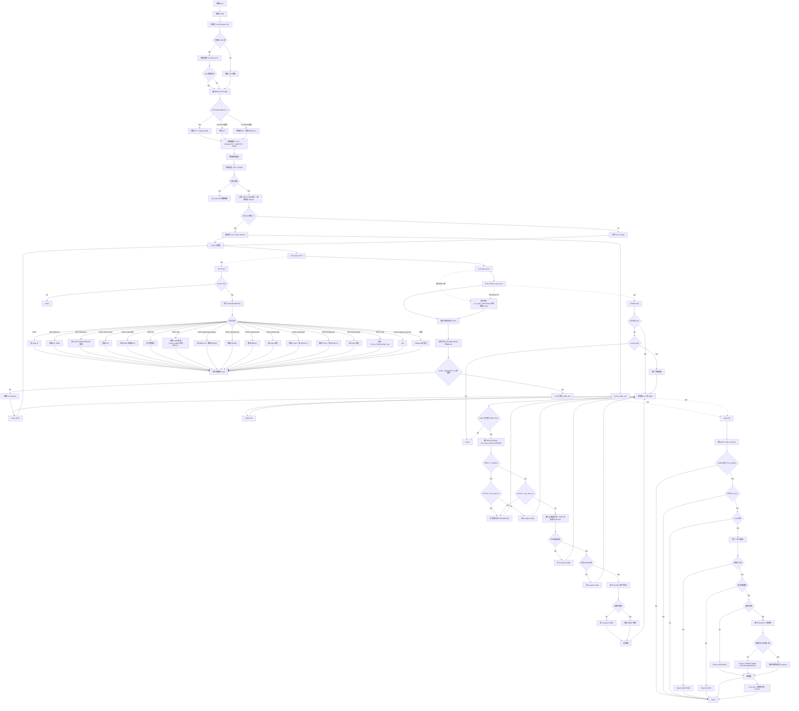

# Gateway 系統整體流程圖（程式現況）

```mermaid
flowchart TD

  %% ========================
  %% Main / Boot
  %% ========================
  M1["開機 Boot"] --> M2["讀取 config"]
  M2 --> M2A["初始化 Hold Register 512"]
  M2A --> M3{有保存 STA 嗎}
  M3 -->|Yes| M4["嘗試連接 STA timeout 6s"]
  M3 -->|No| M5["略過 STA 連線"]
  M4 --> M6{STA 連線成功}
  M6 -->|Yes| M7["讀 REG20 AP Enable"]
  M6 -->|No| M7
  M5 --> M7

  M7 --> M8{AP Enable REG20 = 1}
  M8 -->|Yes| M9["啟動 AP + Captive DNS"]
  M8 -->|No 且 STA成功| M10["不啟 AP"]
  M8 -->|No 且 STA失敗| M11["強制啟 AP + 回寫 REG20=1"]

  M9 --> M12["啟動服務 HTTP + ModbusTCP + CMDTCP + mDNS"]
  M10 --> M12
  M11 --> M12
  M12 --> M13["等待網路穩定"]
  M13 --> M14["系統檢查 UPS + RS485"]
  M14 --> M15{檢查通過}
  M15 -->|No| M16["fail_halt LED 閃爍停機"]
  M15 -->|Yes| M17["註冊 REG21 寫入事件 + 開機同步 REG21"]
  M17 --> M18{REG21 初值 = 1}
  M18 -->|Yes| M19["嘗試啟 Core1 Poller Worker"]
  M18 -->|No| M20["不啟 Core1 Poller"]

  M19 --> M21["Core0 主迴圈"]
  M20 --> M21
  M21 --> M22["poll_cmd_server"]
  M22 --> M23["poll_http_server"]
  M23 --> M24["poll_modbus_tcp_server"]
  M24 --> M25["更新狀態寄存器 50-56"]
  M25 --> M26["檢查命令 REG60/61/62/64（每100ms）"]
  M26 --> M27{poller_enabled 且 core1未啟動}
  M27 -->|Yes| M28["Core0 執行 poller_tick"]
  M27 -->|No| M29["略過 Core0 poller"]
  M28 --> M30["sleep 20ms"]
  M29 --> M30
  M30 --> M21

  M23 -.寫 REG21 時.-> M31["事件回呼 on_reg21_written&#xa;立即啟停 poller"]
  M24 -.寫 REG21 時.-> M31
  M31 --> M25

  M19 --> M32["Core1: poller_tick"]
  M32 --> M33["sleep 5ms"]
  M33 --> M32

  %% ========================
  %% HTTP Server
  %% ========================
  H1["HTTP poll"] --> H2{accept client}
  H2 -->|No| H3["return"]
  H2 -->|Yes| H4["解析 method/path/body"]
  H4 --> H5{路由分流}

  H5 -->|GET /| H6["回 Web UI"]
  H5 -->|GET /wifi/scan| H7["掃描 AP JSON"]
  H5 -->|GET /wifi/status| H8["回 STA AP REG20 REG56 電源"]
  H5 -->|POST /wifi/connect| H9["連線 STA"]
  H5 -->|POST /ap/enable| H10["寫 REG20 並啟停 AP"]

  H5 -->|GET /cfg| H11["回完整設定"]
  H5 -->|POST /cfg| H12["更新 RAM 設定（poller.enabled 同步 REG21）"]
  H5 -->|POST /gateway/configure| H13["寫 REG0-16 + 觸發 REG64"]
  H5 -->|POST /system/save| H14["觸發 REG60"]
  H5 -->|POST /system/reset| H15["觸發 REG61"]

  H5 -->|GET /poller/config| H17["回 Poller 設定"]
  H5 -->|POST /poller/start| H18["啟用 Poller + 寫 REG21=1"]
  H5 -->|POST /poller/stop| H19["停用 Poller + 寫 REG21=0"]
  H5 -->|GET /poller/status| H20["回 Poller 狀態"]
  H5 -->|POST /cmd| H21["委派 Server_CMD.handle_cmd"]
  H5 -->|favicon/apple-touch-icon| H22["204"]
  H5 -->|其他| H23["Fallback 回首頁"]

  H6 --> H24["送回應關閉 client"]
  H7 --> H24
  H8 --> H24
  H9 --> H24
  H10 --> H24
  H11 --> H24
  H12 --> H24
  H13 --> H24
  H14 --> H24
  H15 --> H24
  H17 --> H24
  H18 --> H24
  H19 --> H24
  H20 --> H24
  H21 --> H24
  H22 --> H24
  H23 --> H24

  %% ========================
  %% Modbus TCP Gateway
  %% ========================
  B1["Modbus poll"] --> B2{有活動 client}
  B2 -->|No| B2A{accept client}
  B2A -->|No| B3["return"]
  B2A -->|Yes| B4["建立活動連線"]
  B2 -->|Yes| B5["非阻塞 recv 到 buffer"]
  B4 --> B5
  B5 --> B6{buffer 有完整 MBAP+PDU}
  B6 -->|No| B3

  B6 -->|Yes| B7["讀 REG1/2/3&#xa;(tcp_slave_id/timeout/REG3)"]
  B7 --> B8{REG3 == disabled}

  B8 -->|Yes| B9{Unit ID == tcp_slave_id}
  B9 -->|Yes| B10["本地寄存器 FC03/04/06/16"]
  B10 --> B5
  B9 -->|No| B11["回 exception 0x03"]
  B11 --> B5

  B8 -->|No| B12{Unit ID == tcp_slave_id}
  B12 -->|Yes| B10
  B12 -->|No| B13["讀 cfg 通道參數 + REG3 決定通道 ch0/ch1"]
  B13 --> B14{目標通道啟用}
  B14 -->|No| B15["回 exception 0x0B"]
  B15 --> B5

  B14 -->|Yes| B16{取得 RS485 鎖}
  B16 -->|No| B17["回 exception 0x06"]
  B17 --> B5

  B16 -->|Yes| B18["依 RTU/ASCII 組包送出"]
  B18 --> B19{回覆可解析}
  B19 -->|No| B20["回 exception 0x0B"]
  B20 --> B21["釋放鎖"]
  B21 --> B5
  B19 -->|Yes| B22["封裝 MBAP 回覆"]
  B22 --> B21

  %% ========================
  %% Poller
  %% ========================
  P1["poller.tick"] --> P2["讀 poller config + timeout"]
  P2 --> P3{enabled 或 force_enabled}
  P3 -->|No| P4["return"]
  P3 -->|Yes| P5{到達 next_due}
  P5 -->|No| P4
  P5 -->|Yes| P6{rows 存在}
  P6 -->|No| P4

  P6 -->|Yes| P7["取下一列並解析"]
  P7 --> P8{列格式合法}
  P8 -->|No| P9["Return=BAD ROW"]
  P9 --> P4

  P8 -->|Yes| P10{取得通道鎖}
  P10 -->|No| P11["Return=BUSY"]
  P11 --> P4

  P10 -->|Yes| P12{通道啟用}
  P12 -->|No| P13["Return=DISABLED"]
  P13 --> P14["釋放鎖"]
  P14 --> P4

  P12 -->|Yes| P15["組 RTU/ASCII + 收回覆"]
  P15 --> P16{回覆合法且站號一致}
  P16 -->|No| P17["Return=TIMEOUT/BAD CRC/STA MISMATCH"]
  P17 --> P14
  P16 -->|Yes| P18["更新結果與本地 registers"]
  P18 --> P14
  P14 --> P19["next_due = 結束時間 + interval"]
  P19 --> P4

  %% Integration
  M22 -.call.-> H1
  M24 -.call.-> B1
  M28 -.call.-> P1
  M32 -.call.-> P1
```
