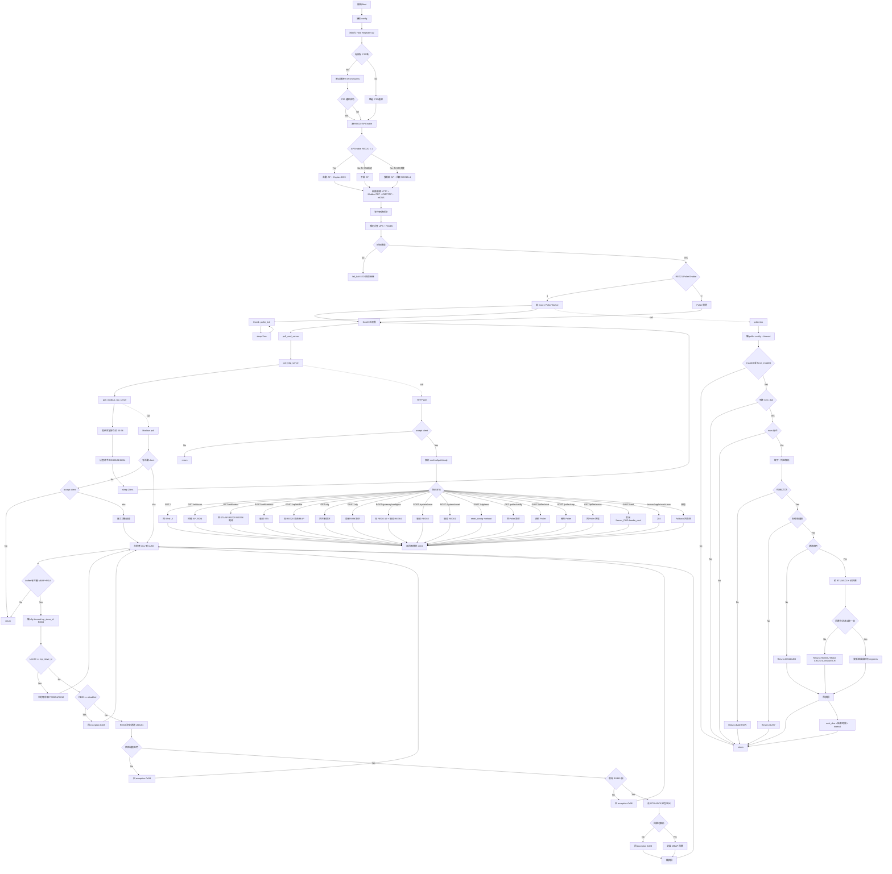

# Gateway 系統整體流程圖（程式現況）

```mermaid
flowchart TD

  %% ========================
  %% Main / Boot
  %% ========================
  M1[開機 Boot] --> M2[讀取 config]
  M2 --> M2A[初始化 Hold Register 512]
  M2A --> M3{有保存 STA 嗎}
  M3 -->|Yes| M4[嘗試連接 STA timeout 6s]
  M3 -->|No| M5[略過 STA 連線]
  M4 --> M6{STA 連線成功}
  M6 -->|Yes| M7[讀 REG20 AP Enable]
  M6 -->|No| M7
  M5 --> M7

  M7 --> M8{AP Enable REG20 = 1}
  M8 -->|Yes| M9[啟動 AP + Captive DNS]
  M8 -->|No 且 STA成功| M10[不啟 AP]
  M8 -->|No 且 STA失敗| M11[強制啟 AP + 回寫 REG20=1]

  M9 --> M12[啟動服務 HTTP + ModbusTCP + CMDTCP + mDNS]
  M10 --> M12
  M11 --> M12
  M12 --> M13[等待網路穩定]
  M13 --> M14[系統檢查 UPS + RS485]
  M14 --> M15{檢查通過}
  M15 -->|No| M16[fail_halt LED 閃爍停機]
  M15 -->|Yes| M17{REG21 Poller Enable}

  M17 -->|1| M18[啟 Core1 Poller Worker]
  M17 -->|0| M19[Poller 關閉]

  M18 --> M20[Core0 主迴圈]
  M19 --> M20
  M20 --> M21[poll_cmd_server]
  M21 --> M22[poll_http_server]
  M22 --> M23[poll_modbus_tcp_server]
  M23 --> M24[更新狀態寄存器 50-56]
  M24 --> M25[檢查命令 REG60/61/62/64]
  M25 --> M26[sleep 20ms]
  M26 --> M20

  M18 --> M27[Core1: poller_tick]
  M27 --> M28[sleep 5ms]
  M28 --> M27

  %% ========================
  %% HTTP Server
  %% ========================
  H1[HTTP poll] --> H2{accept client}
  H2 -->|No| H3[return]
  H2 -->|Yes| H4[解析 method/path/body]
  H4 --> H5{路由分流}

  H5 -->|GET /| H6[回 Web UI]
  H5 -->|GET /wifi/scan| H7[掃描 AP JSON]
  H5 -->|GET /wifi/status| H8[回 STA AP REG20 REG56 電源]
  H5 -->|POST /wifi/connect| H9[連線 STA]
  H5 -->|POST /ap/enable| H10[寫 REG20 並啟停 AP]

  H5 -->|GET /cfg| H11[回完整設定]
  H5 -->|POST /cfg| H12[更新 RAM 設定]
  H5 -->|POST /gateway/configure| H13[寫 REG0-16 + 觸發 REG64]
  H5 -->|POST /system/save| H14[觸發 REG60]
  H5 -->|POST /system/reset| H15[觸發 REG61]
  H5 -->|POST /cfg/reset| H16[reset_config + reboot]

  H5 -->|GET /poller/config| H17[回 Poller 設定]
  H5 -->|POST /poller/start| H18[啟用 Poller]
  H5 -->|POST /poller/stop| H19[停用 Poller]
  H5 -->|GET /poller/status| H20[回 Poller 狀態]
  H5 -->|POST /cmd| H21[委派 Server_CMD.handle_cmd]
  H5 -->|favicon/apple-touch-icon| H22[204]
  H5 -->|其他| H23[Fallback 回首頁]

  H6 --> H24[送回應關閉 client]
  H7 --> H24
  H8 --> H24
  H9 --> H24
  H10 --> H24
  H11 --> H24
  H12 --> H24
  H13 --> H24
  H14 --> H24
  H15 --> H24
  H16 --> H24
  H17 --> H24
  H18 --> H24
  H19 --> H24
  H20 --> H24
  H21 --> H24
  H22 --> H24
  H23 --> H24

  %% ========================
  %% Modbus TCP Gateway
  %% ========================
  B1[Modbus poll] --> B2{有活動 client}
  B2 -->|No| B2A{accept client}
  B2A -->|No| B3[return]
  B2A -->|Yes| B4[建立活動連線]
  B2 -->|Yes| B5[非阻塞 recv 到 buffer]
  B4 --> B5
  B5 --> B6{buffer 有完整 MBAP+PDU}
  B6 -->|No| B3

  B6 -->|Yes| B7[讀 cfg timeout tcp_slave_id REG3]
  B7 --> B8{Unit ID == tcp_slave_id}

  B8 -->|Yes| B9[本地寄存器 FC03/04/06/16]
  B9 --> B5

  B8 -->|No| B10{REG3 == disabled}
  B10 -->|Yes| B11[回 exception 0x03]
  B11 --> B5

  B10 -->|No| B12[REG3 決定通道 ch0/ch1]
  B12 --> B13{目標通道啟用}
  B13 -->|No| B14[回 exception 0x0B]
  B14 --> B5

  B13 -->|Yes| B15{取得 RS485 鎖}
  B15 -->|No| B16[回 exception 0x06]
  B16 --> B5

  B15 -->|Yes| B17[依 RTU/ASCII 組包送出]
  B17 --> B18{回覆可解析}
  B18 -->|No| B19[回 exception 0x0B]
  B19 --> B20[釋放鎖]
  B20 --> B5
  B18 -->|Yes| B21[封裝 MBAP 回覆]
  B21 --> B20

  %% ========================
  %% Poller
  %% ========================
  P1[poller.tick] --> P2[讀 poller config + timeout]
  P2 --> P3{enabled 或 force_enabled}
  P3 -->|No| P4[return]
  P3 -->|Yes| P5{到達 next_due}
  P5 -->|No| P4
  P5 -->|Yes| P6{rows 存在}
  P6 -->|No| P4

  P6 -->|Yes| P7[取下一列並解析]
  P7 --> P8{列格式合法}
  P8 -->|No| P9[Return=BAD ROW]
  P9 --> P4

  P8 -->|Yes| P10{取得通道鎖}
  P10 -->|No| P11[Return=BUSY]
  P11 --> P4

  P10 -->|Yes| P12{通道啟用}
  P12 -->|No| P13[Return=DISABLED]
  P13 --> P14[釋放鎖]
  P14 --> P4

  P12 -->|Yes| P15[組 RTU/ASCII + 收回覆]
  P15 --> P16{回覆合法且站號一致}
  P16 -->|No| P17[Return=TIMEOUT/BAD CRC/STA MISMATCH]
  P17 --> P14
  P16 -->|Yes| P18[更新結果與本地 registers]
  P18 --> P14
  P14 --> P19[next_due = 結束時間 + interval]
  P19 --> P4

  %% Integration
  M22 -.call.-> H1
  M23 -.call.-> B1
  M18 -.call.-> P1
```
