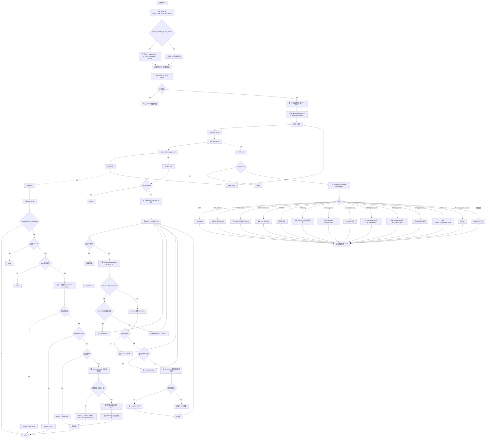

# Gateway 系統整體流程圖（統一版）

```mermaid
flowchart TD

  %% ========================
  %% Main / Boot
  %% ========================
  M1[開機 Boot] --> M2[讀取 config 與 AUTO_CONFIG_AP_ON_BOOT]
  M2 --> M3{AUTO_CONFIG_AP_ON_BOOT ?}
  M3 -->|Yes| M4[先啟 AP + Captive DNS + HTTP TCP Modbus + mDNS]
  M3 -->|No| M5[先略過 AP 與服務啟動]
  M4 --> M6[若有保存 STA 則嘗試連線]
  M5 --> M6
  M6 --> M7[執行系統檢查 UPS + RS485]
  M7 --> M8{檢查通過?}
  M8 -->|No| M9[fail_halt LED 閃爍停機]
  M8 -->|Yes| M10[若 AP 未啟動則補啟 AP + DNS]
  M10 --> M11[若服務未啟動則補啟 HTTP TCP Modbus + mDNS]
  M11 --> M12[進入主迴圈]
  M12 --> M13[poll_cmd_server]
  M13 --> M14[poll_http_server]
  M14 --> M15[poll_modbus_tcp_server]
  M15 --> M16[poller.tick]
  M16 --> M17[sleep 20ms]
  M17 --> M12

  %% ========================
  %% HTTP Server
  %% ========================
  H1[HTTP poll] --> H2{accept client?}
  H2 -->|No| H3[return]
  H2 -->|Yes| H4[讀 Header Body 並解析 method path]
  H4 --> H5{路由}
  H5 -->|GET /| H6[回 Web UI]
  H5 -->|GET /wifi/scan| H7[掃描 AP 清單 JSON]
  H5 -->|GET /wifi/status| H8[回 STA AP 電源資訊 JSON]
  H5 -->|POST /wifi/connect| H9[連線 STA 可選 save]
  H5 -->|GET /cfg| H10[回完整設定]
  H5 -->|POST /cfg| H11[更新設定 AP 設定可即時套用]
  H5 -->|POST /cfg/reset| H12[reset_config 後 machine.reset]
  H5 -->|GET /poller/config| H13[回 Poller 設定]
  H5 -->|POST /poller/start| H14[更新 enabled true 並 set_enabled true]
  H5 -->|POST /poller/stop| H15[更新 enabled false 並 set_enabled false]
  H5 -->|GET /poller/status| H16[回 Poller 執行狀態]
  H5 -->|POST /cmd| H17[委派 Server_CMD.handle_cmd]
  H5 -->|favicon/apple-touch-icon| H18[回 204]
  H5 -->|其他路徑| H19[Fallback 回主頁]
  H6 --> H20[送回應並關閉 client]
  H7 --> H20
  H8 --> H20
  H9 --> H20
  H10 --> H20
  H11 --> H20
  H12 --> H20
  H13 --> H20
  H14 --> H20
  H15 --> H20
  H16 --> H20
  H17 --> H20
  H18 --> H20
  H19 --> H20

  %% ========================
  %% Modbus TCP Gateway
  %% ========================
  B1[Modbus poll] --> B2{accept client?}
  B2 -->|No| B3[return]
  B2 -->|Yes| B4[建立連線並進入每 client 迴圈]
  B4 --> B5[讀 MBAP 7 bytes 與 PDU]
  B5 --> B6{封包可解析?}
  B6 -->|No| B7[結束連線]
  B6 -->|Yes| B8[讀 modbus config timeout tcp_slave_id]
  B8 --> B9{Unit ID == tcp_slave_id ?}
  B9 -->|Yes| B10{Func 03/04 且範圍合法?}
  B10 -->|Yes| B11[回本地 registers]
  B10 -->|No| B12[回 exception 0x01 或 0x02]
  B11 --> B5
  B12 --> B5
  B9 -->|No| B13[unit map 對應 CH0 CH1]
  B13 --> B14{有可用通道?}
  B14 -->|No| B15[回 exception 0x0B]
  B15 --> B5
  B14 -->|Yes| B16{取得 RS485 鎖?}
  B16 -->|No| B17[回 exception 0x06]
  B17 --> B5
  B16 -->|Yes| B18[依 RTU/ASCII 組包送出並等回覆]
  B18 --> B19{回覆可解析?}
  B19 -->|No| B20[回 exception 0x0B]
  B20 --> B21[釋放鎖]
  B21 --> B5
  B19 -->|Yes| B22[封裝 MBAP 回覆]
  B22 --> B21
  B7 --> B23[close client]

  %% ========================
  %% Poller
  %% ========================
  P1[poller.tick] --> P2[讀 poller config]
  P2 --> P3{enabled 或 force_enabled?}
  P3 -->|No| P4[return]
  P3 -->|Yes| P5{到達 interval?}
  P5 -->|No| P6[return]
  P5 -->|Yes| P7{rows 是否存在?}
  P7 -->|No| P8[return]
  P7 -->|Yes| P9[取下一列並解析 ch station cmd reg data]
  P9 --> P10{列格式合法?}
  P10 -->|No| P11[Return = BAD ROW]
  P11 --> P4
  P10 -->|Yes| P12{取得 RS485 鎖?}
  P12 -->|No| P13[Return = BUSY]
  P13 --> P4
  P12 -->|Yes| P14{通道啟用?}
  P14 -->|No| P15[Return = DISABLED]
  P15 --> P16[釋放鎖]
  P16 --> P4
  P14 -->|Yes| P17[組 RTU/ASCII frame 送出並收回覆]
  P17 --> P18{回覆有效且站號一致?}
  P18 -->|No| P19[Return = TIMEOUT BAD CRC 或 STA MISMATCH]
  P19 --> P16
  P18 -->|Yes| P20[解析回覆並更新本地 registers]
  P20 --> P21[更新 Return 與最近通訊狀態]
  P21 --> P16

  %% ========================
  %% Integration
  %% ========================
  M14 -.call.-> H1
  M15 -.call.-> B1
  M16 -.call.-> P1
```
